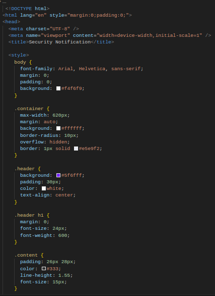
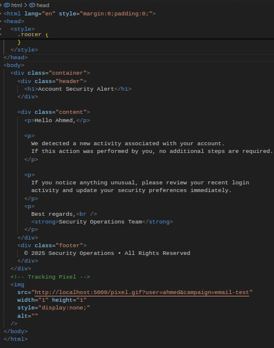
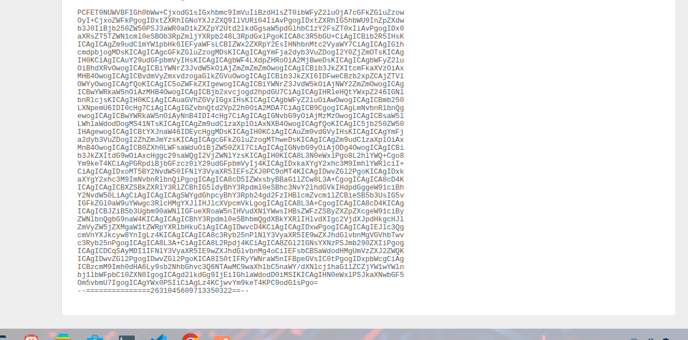
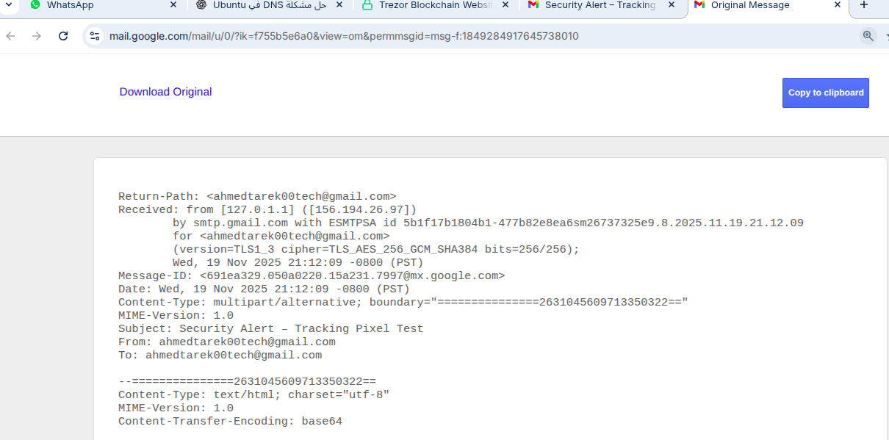

<h1 align="center" style="font-weight:900; font-size:46px; color:#5f6fff;">
🛡️ Tracking Pixel SOC Lab 
</h1>

<p align="center" style="font-size:20px; color:#555; margin-top:-10px;">
Advanced Blue Team Email Telemetry • Real Defensive Pipeline • Flask-based SOC Logging
</p>

<p align="center">
  
  
  
  
</p>

<hr style="border:0; border-top:2px solid #ececec; margin:40px 0;"/>

---

# 🌐 **1. Executive Overview**

<p style="font-size:17px; line-height:1.65; color:#333;">
This project demonstrates how corporate security teams analyze <b>email-open telemetry</b> using a hidden <b>1×1 tracking pixel</b>.  
The pixel is embedded inside a professional HTML security alert email and reports key metadata to a backend <b>Flask Telemetry Server</b>.  
Events are stored in a structured <b>JSONL</b> log pipeline and visualized through a custom <b>real-time SOC dashboard</b>.
<br><br>
This documentation is intentionally styled with enterprise-level layout, inline images, flowing paragraphs, and clean section breaks, similar to Wazuh, Kubernetes Goat, and Elastic Security documentation.
</p>


---

# 🛠️ **2. How to Run This Lab (Full Setup Guide)**

<p style="font-size:17px; color:#333; line-height:1.6;">
This section provides the exact commands required to build, configure, and execute the full Tracking Pixel SOC Lab.  
All steps follow a clean, reproducible, production-style workflow — from environment bootstrapping to sending the actual email and receiving telemetry.
</p>

---

## ⚙️ **2.1 Create Project Environment**

<pre style="background:#000; color:#0f0; padding:20px; border-radius:10px; font-size:15px;">
mkdir tracking-pixel-soc-lab
cd tracking-pixel-soc-lab

python3 -m venv venv
source venv/bin/activate

pip install flask
</pre>

---

## 🧩 **2.2 Generate the 1×1 Tracking Pixel**

<pre style="background:#000; color:#0f0; padding:20px; border-radius:10px; font-size:15px;">
printf '\x47\x49\x46\x38\x39\x61\x01\x00\x01\x00\x80\x00\x00\x00\x00\x00\xFF\xFF\xFF\x21\xF9\x04\x01\x00\x00\x00\x00\x2C\x00\x00\x00\x00\x01\x00\x01\x00\x00\x02\x02\x44\x01\x00\x3B' > 1x1.gif
</pre>

---

## 📡 **2.3 Create Backend Telemetry Server (app.py)**  
*This file logs email-open events & serves the pixel.*

Create the file:

<pre style="background:#111; color:#0f0; padding:20px; border-radius:10px; font-size:15px;">
nano app.py
</pre>

Paste your Flask server code inside it.

Run the server:

<pre style="background:#000; color:#0f0; padding:20px; border-radius:10px; font-size:15px;">
python3 app.py
</pre>

---

## 🖥️ **2.4 Create SOC Dashboard (templates/dashboard.html)**

<pre style="background:#111; color:#0f0; padding:20px; border-radius:10px; font-size:15px;">
mkdir templates
nano templates/dashboard.html
</pre>

Paste the dashboard UI HTML.

---

## ✉️ **2.5 Build the HTML Security Email (email.html)**

<pre style="background:#111; color:#0f0; padding:20px; border-radius:10px; font-size:15px;">
nano email.html
</pre>

Insert the full professional email template including:


```
---

📤 2.6 Send REAL Email Using Python (send_email.py)

<pre style="background:#000; color:#0f0; padding:20px; border-radius:10px; font-size:15px;">
nano send_email.py
</pre>Add your Gmail SMTP script (using Gmail App Password).

Then send it:

<pre style="background:#000; color:#0f0; padding:20px; border-radius:10px; font-size:15px;">
python3 send_email.py
</pre>
---

📥 2.7 Open Email → Pixel Fires → Logs Collected

When the recipient (you) opens email:

The pixel loads

Flask receives GET /pixel.gif

A new entry is appended to logs/events.jsonl

The SOC dashboard displays the new event in real time


This confirms the telemetry workflow is fully operational.


# 🎨 **2. Email Rendering Preview (Inline & Centered)**

<p style="font-size:17px; color:#333; line-height:1.6;">
Below is the exact HTML email as displayed locally before sending.  
The tracking pixel is invisible, but the UI reflects a corporate-grade notification design.
</p>

<p align="center">
  
</p>

---

# 📧 **3. Real Gmail Delivery (Proof of Execution)**

<p style="font-size:17px; color:#333; line-height:1.6;">
Once the email was sent using Python’s SMTP SSL client, Gmail rendered the message and automatically loaded the embedded pixel — generating telemetry captured by the backend server.
</p>

<p align="center">
  
</p>

---

# 🏗️ **4. Architecture & Workflow (Readable Diagram)**

<p style="font-size:17px; color:#333; line-height:1.6;">
The following diagram outlines the complete telemetry pipeline, from email open to SOC dashboard ingestion.  
Designed for clarity and corporate-style documentation.
</p>

<pre style="background:#0d1117; color:#00e676; padding:22px; border-radius:10px; font-size:15px; line-height:1.55;">
 ┌───────────────────────────────┐
 │     User Email Client         │
 │ (Gmail / Outlook / Browser)   │
 └──────────────┬────────────────┘
                │   1) Email Open
                ▼
 ┌───────────────────────────────┐
 │  HTML Security Notification   │
 │   + Hidden Tracking Pixel     │
 └──────────────┬────────────────┘
                │   2) Pixel Request
                ▼
 ┌────────────────────────────────────────┐
 │         Flask Telemetry Receiver       │
 │  Logs: IP • User-Agent • Timestamp     │
 │        Query Params (user/campaign)    │
 └──────────────┬─────────────────────────┘
                │   3) JSONL Write
                ▼
 ┌───────────────────────────────┐
 │        events.jsonl           │
 │   (Structured Log Storage)    │
 └──────────────┬────────────────┘
                │   4) Dashboard Fetch
                ▼
 ┌────────────────────────────────────────┐
 │     Real-Time SOC Dashboard (UI)       │
 │     Auto-refresh every 5 seconds       │
 └────────────────────────────────────────┘
</pre>

---

# 📊 **5. SOC Dashboard (Inline Evidence)**

<p style="font-size:17px; color:#333; line-height:1.6;">
The SOC dashboard provides a clean, table-based representation of all incoming pixel events.  
It auto-updates every 5 seconds without requiring manual page reloads.
</p>

<p align="center">
  
</p>

---

# 💻 **6. Terminal Logs (Copy-Friendly + Visual Evidence)**

<p style="font-size:17px; color:#333; line-height:1.6;">
Below are the real terminal outputs generated during execution.  
The first block is copy-ready code, while the screenshots confirm real-world log activity.
</p>

### ✅ **Terminal Execution (Copy Me)**

<pre style="background:#000; color:#0f0; padding:20px; border-radius:10px; font-size:15px;">
source venv/bin/activate
python3 app.py

 * Serving Flask app 'app'
 * Debug mode: on
 * Running on http://127.0.0.1:5000
</pre>

<p align="center">
  
</p>

<p align="center">
  
</p>

---

# 🧠 7. Base64 & code 

<p style="font-size:17px; color:#333; line-height:1.1;">
Below are the real terminal outputs generated during execution.  
The first block is copy-ready code, while the screenshots confirm real-world log activity.
</p>

<p align="center">
   


    


       
   


    


   


  
</p>


# 🧠 **8. Why This Lab Matters (Professional Explanation)**

<p style="font-size:17px; color:#333; line-height:1.6;">
Email tracking pixels are widely used in real enterprise ecosystems — both offensively and defensively.  
This project demonstrates the defensive perspective:
</p>

- Understanding metadata exposure  
- Monitoring remote email opens  
- Visualizing client-side behavior  
- Detecting unusual access patterns  
- Building custom SOC dashboards  
- Working with JSONL pipelines  
- Reproducing realistic corporate workflows  


---

<p align="center" style="font-size:18px; margin-top:40px; color:#5f6fff;">
<b>Designed & Implemented by Ahmed Tarek — Blue Team • Cloud Security Engineering</b>
</p>
