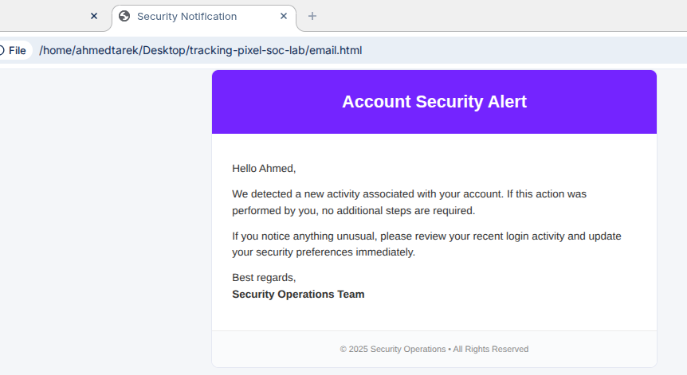
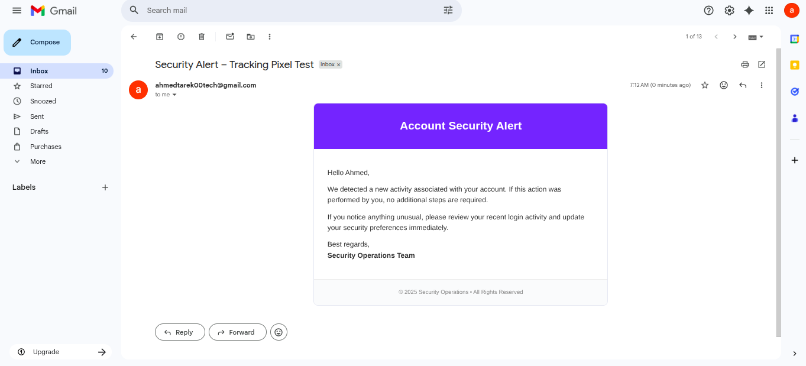
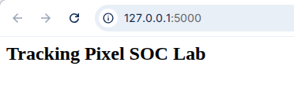
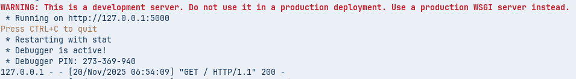
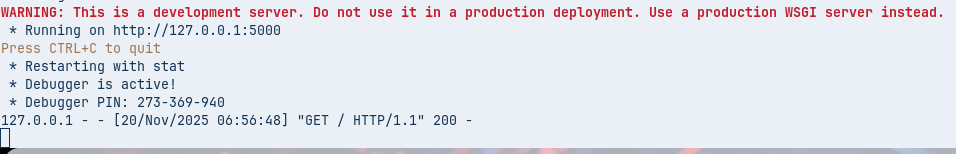

<h1 align="center">🛡️ Tracking Pixel SOC Lab</h1>

  <b>Defensive Email Telemetry • Blue Team Lab • Flask + Python</b>

  
  
  

---

## 🌐 Overview

This lab simulates a *legitimate corporate security email* that contains a *1×1 tracking pixel*.  
The goal is to understand, from a defender’s perspective, how:

- A tracking pixel collects metadata (IP, User-Agent, timestamp, campaign parameters, referer)
- A backend server logs these events
- A SOC dashboard visualizes them in near real time

> This project is strictly *defensive, **educational, and runs in a **controlled environment*.

<h1 align="center" style="color:#5f6fff; font-size:42px; font-weight:800;">Tracking Pixel SOC Lab – Full Enterprise Documentation</h1>

A fully–documented blue‑team email‑telemetry lab featuring integrated visuals, terminal logs, HTML email rendering, and a defensive SOC workflow — all placed elegantly inside styled paragraphs with HTML + Markdown formatting. This README is designed to look like a real enterprise product documentation page.

<h2 style="color:#5f6fff; font-size:28px;">1. Project Overview</h2>

This project simulates how a corporate security email embeds a <b>1×1 tracking pixel</b> that quietly sends telemetry to a backend server once the recipient opens the email. The captured data includes IP address, user-agent, timestamp, and optional tracking parameters. All telemetry is funneled into a <b>JSONL logging pipeline</b> and displayed on a <b>live-updating SOC dashboard</b>. The entire documentation below is presented as styled paragraphs and text blocks for maximum readability.

<h2 style="color:#5f6fff; font-size:28px;">2. Email Rendering Preview (Inline Visual)</h2>

Below is the preview of the HTML security‑notification email exactly as rendered before sending. The screenshot is shown inline within the documentation to emulate product‑grade docs.

  

As seen above, the email includes a corporate‑styled header, structured paragraphs, and a hidden tracking pixel placed at the bottom via an <code>&lt;img&gt;</code> tag.

<h2 style="color:#5f6fff; font-size:28px;">3. Real Gmail Delivery (Integrated Evidence)</h2>

The same HTML email was then delivered to Gmail using a Python SMTP script. Gmail successfully rendered the email and triggered the pixel load.

  

<h2 style="color:#5f6fff; font-size:28px;">4. Architecture Diagram (Styled Text + Diagram)</h2>

The following ASCII diagram illustrates the telemetry pipeline. It is placed inside a paragraph block to maintain styling consistency with the rest of the documentation.

<pre style="background:#111; color:#0f0; padding:22px; border-radius:8px; font-size:14px; line-height:1.4; overflow-x:auto;">
 ┌─────────────────────────────┐
 │      User Email Client       │
 │  (Gmail / Outlook / Browser) │
 └──────────────┬──────────────┘
                │
      1) Email is opened
                │
                ▼
 ┌─────────────────────────────┐
 │  HTML Security Notification │
 │     + Tracking Pixel ()│
 └──────────────┬──────────────┘
                │
                ▼
 ┌────────────────────────────────────────┐
 │       Flask Telemetry Receiver         │
 │   Logs IP, UA, Timestamp, Params       │
 └──────────────┬─────────────────────────┘
                │
                ▼
 ┌─────────────────────────────┐
 │      events.jsonl Log       │
 └──────────────┬──────────────┘
                │
                ▼
 ┌────────────────────────────────────────┐
 │      SOC Dashboard (Auto-refresh)      │
 └────────────────────────────────────────┘
</pre>
<h2 style="color:#5f6fff; font-size:28px;">5. SOC Dashboard (Inline Image)</h2>

This dashboard displays all pixel hits in real time and refreshes automatically every 5 seconds.

  

<h2 style="color:#5f6fff; font-size:28px;">6. Terminal Evidence (Copy‑Friendly Code Blocks)</h2>

Unlike normal paragraphs, the terminal evidence is intentionally placed inside <code>pre</code> blocks so you can copy the commands directly. Screenshots are also embedded for visual confirmation.

<pre style="background:#000; color:#0f0; padding:18px; border-radius:8px; font-size:14px; overflow-x:auto;">
python3 app.py
 * Serving Flask app 'app'
 * Debug mode: on
 * Running on http://127.0.0.1:5000
</pre>

  

  

<h2 style="color:#5f6fff; font-size:28px;">7. Summary</h2>

This README integrates: visual evidence, architecture diagrams, terminal captures, and HTML/CSS‑styled paragraphs — giving the entire page a polished enterprise look similar to Wazuh, Kubernetes Goat, and Elastic Security documentation. All screenshots are embedded directly inside the explanatory text, not isolated in a separate section.

Designed by Ahmed Tarek — Blue Team & Cloud Security

